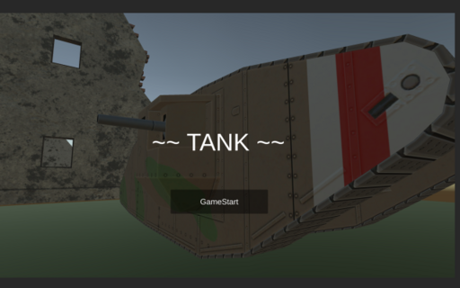
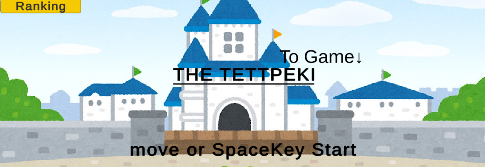

# Portfolio

- 岩立　一樹
- 連絡先 Twitter [@T3485_72](https://twitter.com/T3485_72)  / Email [hitugi3485@gmail.com](hitugi3485@gmail.com)
- 専門学校デジタルアーツ東京 ゲームプログラムコース 2024年卒業予定

## 資格 
- ビジネス能力検定 3級

## スキル
- C#
  - 利用歴1年
  - Visual Studioで独自のツールの作成が可能
- Unity
  - 利用歴1～2年
  - オリジナルの個人/チーム作品の開発経験あり
- C/C++
  - 利用歴1年
  - コンソールで簡単なデータ処理プログラムを開発

## 取り組んでいるテーマ
1. unityでのオリジナルゲーム開発
2. 監視カメラを主人公としたゲームの企画中

## 作品リスト

### トラックリスマス

[truckxms](https://unityroom.com/games/truchristmas)

道に落ちたプレゼントを回収してクリスマスツリーに届けよう!
(その後はサンタさんがなんとかしてくれるはず...)

- 開発環境：Unity
- 開発期間：2～3週間
- 1週間ゲームジャム「おくる」参加作品

### TANK1916

(UnityRoomリンク)[TANK1916](https://unityroom.com/games/tank1916)

射撃を敵に当ててスコアをゲット! 

- 開発環境：Unity
- 開発期間：約1ヶ月半

### THE TETTEPEKI

[THE TETTEPEKI] 開発中

プレイヤーに矢が当たるとゲームオーバー 盾で矢を弾くとスコアがもらえる
- 開発環境：Unity
- 開発期間：2022年12月～現在開発中

## 連絡先
- Twitter [@T3485_72](https://twitter.com/T3485_72)
- E-mail [hitugi3485@gmail.com](hitugi3485@gmail.com)
