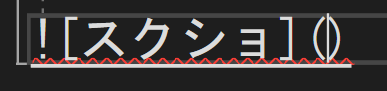

# Portfolio

- 岩立　一樹
- 連絡先 Twitter [@T3485_72]  / Email [hitugi3485@gmail.com](hitugi3485@gmail.com)
- 専門学校デジタルアーツ東京 ゲームプログラムコース 2024年卒業予定

## スキル
- C#
  - 利用歴1年
  - Visual Studioで独自のツールの作成が可能
- Unity
  - 利用歴1年
  - オリジナルの個人/チーム作品の開発経験あり
- C/C++
  - 利用歴1年
  - コンソールで簡単なデータ処理プログラムを開発

## 取り組んでいるテーマ
1. オリジナルゲーム開発

## 作品リスト

### TANK1916

[TANK1916](https://unityroom.com/games/tank1916)

myn

- 開発環境：Unity
- 開発期間：3～4週間

### a

[a](a)

「a」
- 開発環境：Unity
- 開発期間：2週間半
a

## 連絡先
- Twitter [@T3485_72]
- E-mail [hitugi3485@gmail.com](hitugi3485@gmail.com)