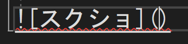

# 大見出し //数は6こまで増やせる
## 中見出し
### 小見出し

普通の文字
**太字**。

**mozi**
斜体

*文字mozi*
~~取り消し~~

X<sub>2<sub>

X<sup>2<sup>

しか抜粋

>ここに引用部分を書く

整数は`int`型がよし

csで色がついたりする
```
int a;
a = 1;
Debug.Log($"a");
```
リンク [READ.md](README.md)

)



- 箇条書き
  - 筒木
    - iiiiiiiiiiiiiiiiiiiiiiiiiiiiiiiiiiiiiiiiiiiiiiiiiiiiiiiiiiiiiiiiiiii
    
 1. あ
    - 下げ
 1. い
    1. い-1
    1. い-2
 1. う
 1. え
 1. お

 - [ ] 差ジョイ
 - [x] チェックリスト
 - [ ] /(リンク) おまけ

 |No|名前|フリガナ|
 |-:|:-:|:-|
 |右揃え|中央揃え|左揃え|
 |1|名前|ナマエ|
 |2|問題ない|モンダイナイ|